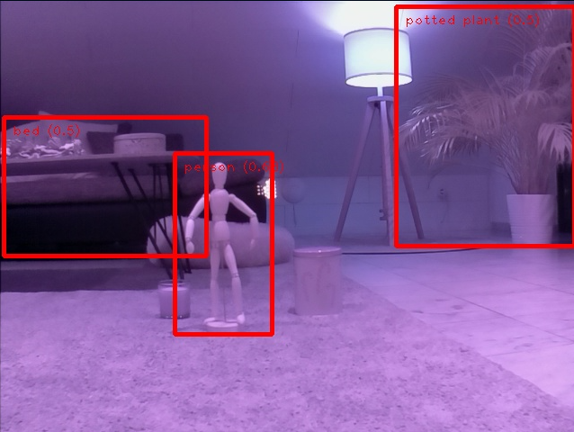
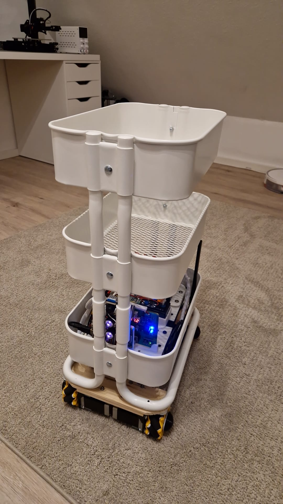
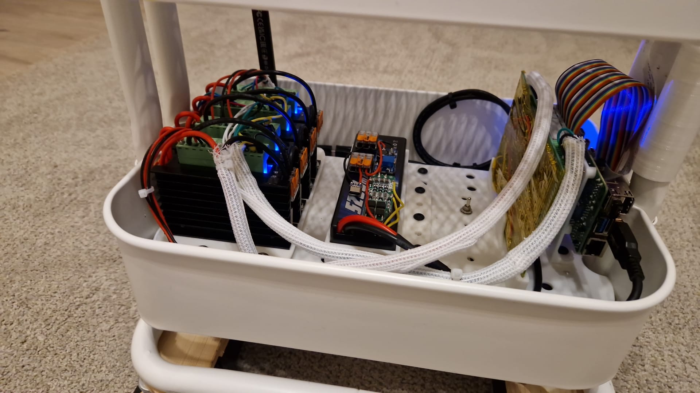
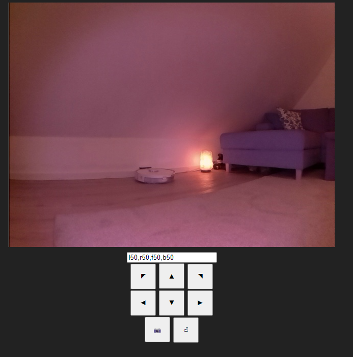

# MateBot
A bigger robot that is built around some small IKEA furniture.

## Object Detection

The robot runs on a raspberry pi 4, thus runs on tensorflow lite for object detection

## Wiring

- gpio_mode=GPIO.BCM
- All pin declarations are like "GPIO123"

## Setup TFLite for object recognition with camera

- pip install "picamera[array]"
- pip install tflite-runtime
- sudo apt-get install libatlas-base-dev
- pip install tflite_support

### Drive Steppers

> Those stepper drivers activate by setting ENA pin to LOW

| Stepper |ENA | DIR | STEP |
|-|-|-|-|
| Front Left | 26 | 11 | 9 |
| Front Right | 26 | 10 | 22 |
| Back Left | 26 | 19 | 13 |
| Back Right | 26 | 6 | 5 |

### Lidar Stepper

> This stepper driver activate by setting SLP pin to HIGH

| SLP | DIR | STEP |
|-|-|-|
| 21 | 16 | 20 |

### Lidar

| RXD/SDA | TXT/SCL |
|-|-|
| 15 | 14 |

### CJMCU-219 INA219 Voltage / Current Meter

| SDA | SCL |
|-|-|
| 2 | 3 | 

### MPU6050 Gyroscope / Acceleration Sensor

| SDA | SCL |
|-|-|
| 2 | 3 | 

## Setting raspberry autostart services up

* Make `robot_server.py` executable
    * $ `chmod +x robot_server.py`
* Copy `robot_server.service` to `/lib/systemd/system`
* Change `ExecStart=` command inside `*.service` accordingly to path where `robot_server.py` is located
* Enable daemon process
    * $ `sudo systemctl daemon-reload`
    * $ `sudo systemctl enable robot_server.service`
    * $ `sudo systemctl start robot_server.service`
* Enable daily reboot at 2am (to automatically fix (e.g.) networking errors
  * `sudo crontab -e`
  * Enter as new line and save --> `0 2 * * * /sbin/reboot`

### Useful commands for process monitoring

* Check status
    * $ `sudo systemctl status robot_server.service`
* Start service
    * $ `sudo systemctl start robot_server.service`
* Stop service
    * $ `sudo systemctl stop robot_server.service`
* Check service's log
    * $ `sudo journalctl -f -u robot_server.service`

## Webserver interface

- Arrow buttons can be used for direct remote control
- Camera button can be used to take a photo and directly download it
- Enter button will execute the "move command" in the input field at the top
     - Move commands can be either f (forward), b (backward), l (left), r (right)
     - For f and b, the number after the char is in cm (distance)
     - For l and r, the number after the char is in degree (angle)
     - Commands can be concatenated by using commas
     - E.g. command: "f50,l30,b10,r5" will move the robot 50cm forward, then 30° to the left,
     then 10cm backward and finally 5° to the right 

